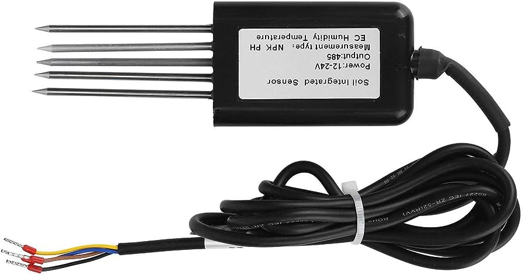

# Usage

1. Connect 4 pin cable from sensor to "RS485 to USB converter"
2. Download and install CH340 Driver from internet to your computer
3. Connect "RS485 to USB converter" to your computer
4. Find connected COM in Device Manager
5. Modify code beside your COM that you use
6. Run program using python3

### Sensor Preview

